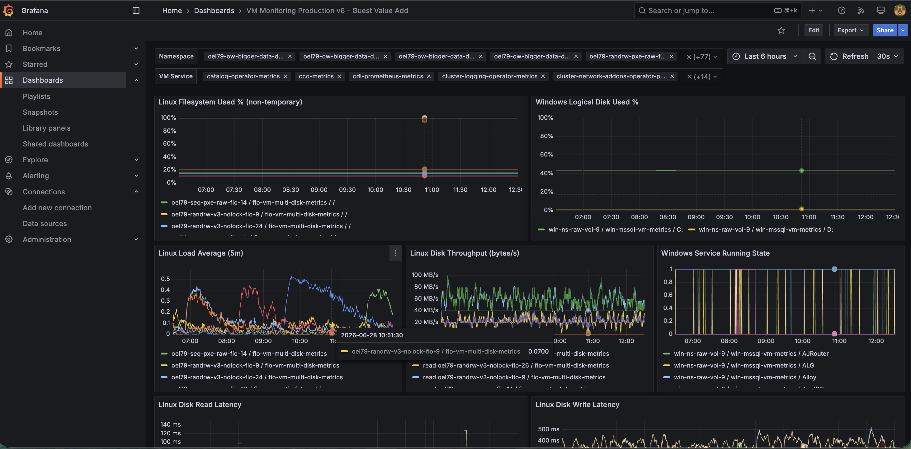
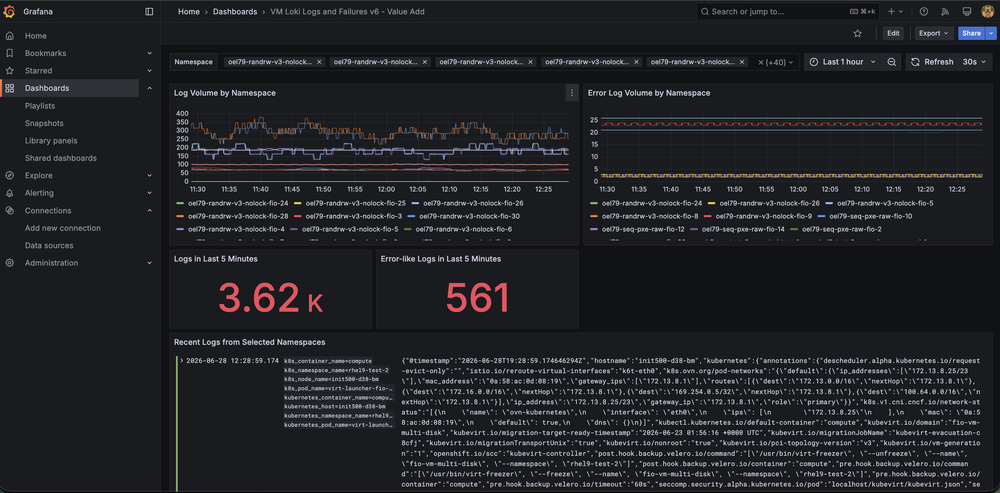
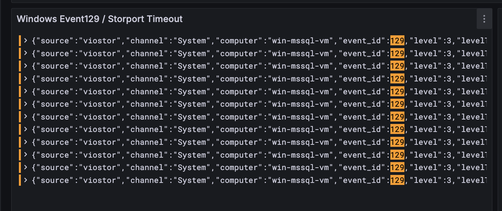
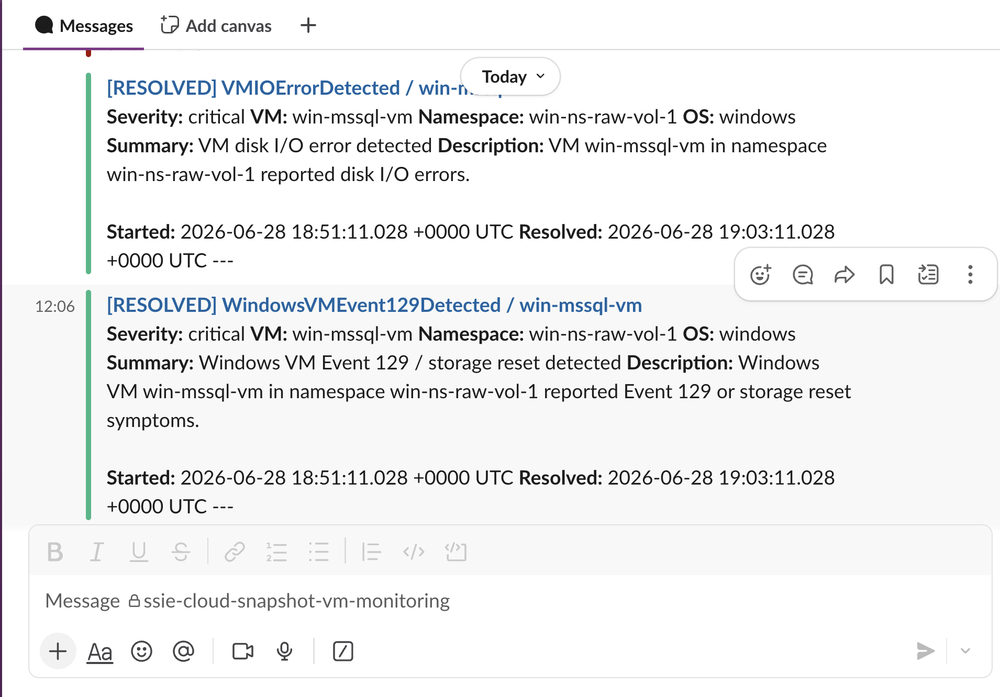

# KubeVirt Virtual Machine Observability Platform

> **Project Status:** Active Development
>
> **KubeVirt Observability Operator** is the first component of the **KubeVirt Virtual Machine Observability Platform**.
>
> The project is under active development. Upcoming releases will introduce **Observability Profiles**, **Event Filtering**, **Namespace-local Secrets**, and **QEMU Guest Agent (QGA)** integration.

KubeVirt Observability Operator provides end-to-end observability for **Linux** and **Windows** virtual machines running on **KubeVirt** and **Red Hat OpenShift Virtualization**.

The operator automates deployment and lifecycle management of observability components, enabling platform teams to collect **metrics**, **logs**, **dashboards**, and **alerts** using the cloud-native observability stack.

Supported integrations include:

* Prometheus
* Grafana
* Grafana Alloy
* OpenShift Loki
* Alertmanager
* Slack

---

## Why KubeVirt Observability Operator?

Modern virtual machine platforms require observability beyond Kubernetes infrastructure metrics.

Platform engineers need visibility into guest operating systems to troubleshoot:

* Windows Event Logs
* Linux system logs
* Storage failures
* Event 129
* BSOD / BugCheck
* Filesystem errors
* Performance bottlenecks
* Guest operating system health

KubeVirt Observability Operator automatically deploys and configures observability components inside Linux and Windows virtual machines while integrating with the Kubernetes observability ecosystem.

---

## Architecture

```text
                         KubeVirt Cluster
                                │
          ┌─────────────────────┴─────────────────────┐
          │                                           │
      Linux VM                                  Windows VM
          │                                           │
   node_exporter                           windows_exporter
          │                                           │
          └─────────────────┬─────────────────────────┘
                            │
                      Grafana Alloy
                      │            │
                 Prometheus       Loki
                      │            │
                      └──────┬─────┘
                             │
                         Grafana
                             │
                      Alertmanager
                             │
                           Slack
```

---

## Features

### Metrics

* Linux monitoring using node_exporter
* Windows monitoring using windows_exporter
* Automatic Prometheus integration
* VM-specific Prometheus alert rules
* Unified Linux and Windows dashboards

### Logging

* Grafana Alloy deployment
* OpenShift Loki integration
* Linux syslog collection
* Windows Event Log collection
* VM-aware log labeling

### Dashboards

* Unified metrics dashboard
* VM log analytics
* Failure analytics
* Infrastructure health
* Storage performance
* Guest operating system insights

### Alerting

* Prometheus alerts
* Loki alerts
* Alertmanager integration
* Slack notifications

### Bootstrap

* Linux Cloud-Init
* Windows Sysprep
* Existing VM onboarding
* Automatic observability bootstrap

---

## Screenshots

### Unified Metrics Dashboard

Monitor Linux and Windows virtual machine CPU, memory, filesystem, storage, network, latency, queue depth, and service health from a single Grafana dashboard.



### Virtual Machine Log Analytics

Analyze Linux syslog and Windows Event Logs using Grafana Loki with namespace and virtual machine level filtering.



### Failure Analytics

Detect Windows Event 129, BSOD, WER events, Linux kernel panics, filesystem failures, storage issues, and other guest operating system failures.



### Slack Notifications

Receive real-time Prometheus and Loki alerts through Alertmanager with VM name, namespace, operating system, severity, and failure details.



---

## Supported Components

| Component                | Status |
| ------------------------ | :----: |
| Linux Virtual Machines   |    ✅   |
| Windows Virtual Machines |    ✅   |
| KubeVirt                 |    ✅   |
| OpenShift Virtualization |    ✅   |
| Prometheus               |    ✅   |
| Grafana Alloy            |    ✅   |
| OpenShift Loki           |    ✅   |
| Grafana                  |    ✅   |
| Alertmanager             |    ✅   |
| Slack Notifications      |    ✅   |

---

## Current Capabilities

* Automatic VM observability bootstrap
* Metrics collection
* Log collection
* Unified dashboards
* Prometheus alerting
* Loki alerting
* Existing VM onboarding
* Linux and Windows guest observability

---

## Roadmap

### v0.2

* Observability Profiles

  * Metrics Only
  * Logs Only
  * Full Observability
* Windows Event filtering
* Linux log filtering
* Namespace-local secrets
* QEMU Guest Agent (QGA) transport
* SSH as optional fallback

### Future

* AI-assisted troubleshooting
* MCP integration
* Capacity planning
* VM rightsizing recommendations
* Performance analytics

---

## Quick Start

Clone the repository:

```bash
git clone https://github.com/portworx/kubevirt-observability-operator.git
cd kubevirt-observability-operator
```

Deploy the current manifests:

```bash
kubectl apply -f config/
```

> Installation documentation is being expanded. See the roadmap for upcoming production installation, configuration, and upgrade guides.

---

## Documentation

Documentation is continuously expanding.

Upcoming guides include:

* Installation
* Platform prerequisites
* Existing VM onboarding
* Linux configuration
* Windows configuration
* Dashboards
* Alerting
* Troubleshooting
* Architecture

---

## Contributing

Contributions are welcome.

Please read [CONTRIBUTING.md](CONTRIBUTING.md) before submitting pull requests.

---

## Security

Please report security vulnerabilities privately.

See [SECURITY.md](SECURITY.md).

---

## License

Apache License 2.0. See [LICENSE](LICENSE).
